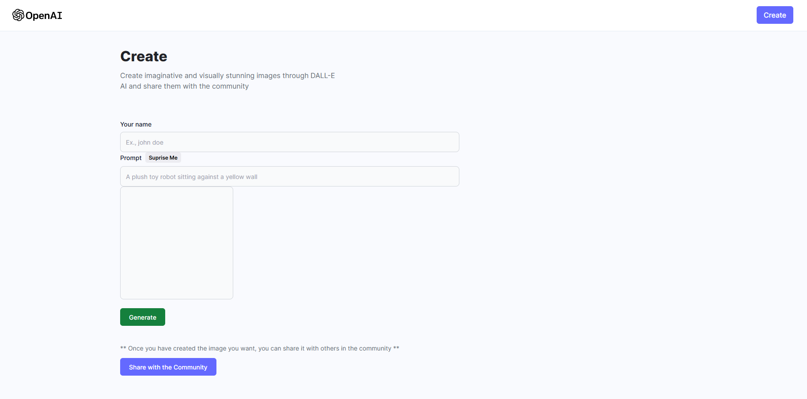
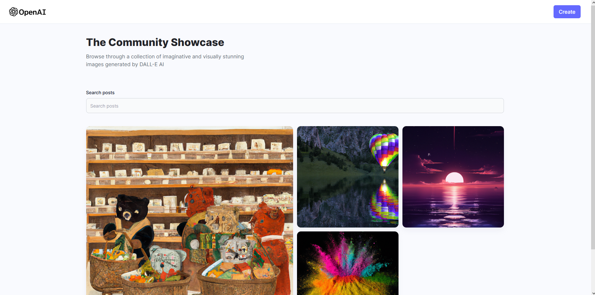

<!-- Banner Section -->

# 🛠️ Full Stack MERN AI Image Generation App

## Midjourney & DALL-E Clone

<!--  -->

<!-- link to project -->
    <a href='-URL TO DEMO GOES HERE-'>
    <!-- link to local image -->
        
    </a>
    <a href='-URL TO DEMO GOES HERE-'>
    <!-- link to local image -->
        
    </a>

<!-- **Link to project:** http://recruiters-love-seeing-live-demos.com/ -->
 
 

This Image Generator is a full-stack web application created with the MERN stack. It allows users to generate custom images with a variety of options, including text, shapes, and colors... To see how it works please follow the "Website button" link just above.

## How It's Made:

**Tech used:** HTML, CSS, JavaScript, **M**ongoDB, **E**xpress, **R**eact, **N**odeJS, Vite and Tailwind.
 
 

  

 

   The application also provides an intuitive user interface for creating and editing images. With this application, users can quickly create unique images for their projects or websites. 
   
   This project was built based on this  from JSMastery.

**Build and Deploy a Full Stack MERN AI Image Generation App MidJourney & DALL E Clone**

  <a href='https://github.com/adrianhajdin/project_ai_mern_image_generation'>
  <!-- link to local image -->
      
  </a>

<!-- 

  

 -->

<!-- &nbsp;
&nbsp;&nbsp;
&nbsp;&nbsp; -->

## Optimizations

_(optional)_

You don't have to include this section but interviewers _love_ that you can not only deliver a final product that looks great but also functions efficiently. Did you write something then refactor it later and the result was 5x faster than the original implementation? Did you cache your assets? Things that you write in this section are **GREAT** to bring up in interviews and you can use this section as reference when studying for technical interviews!

## Lessons Learned:

No matter what your experience level, being an engineer means continuously learning. Every time you build something you always have those _whoa this is awesome_ or _fuck yeah I did it!_ moments. This is where you should share those moments! Recruiters and interviewers love to see that you're self-aware and passionate about growing.

## Examples:

Take a look at these couple examples that I have in my own portfolio:

**Palettable:** https://github.com/alecortega/palettable

**Twitter Battle:** https://github.com/alecortega/twitter-battle

**Patch Panel:** https://github.com/alecortega/patch-panel

**Patch Panel:** https://github.com/alecortega/patch-panel
